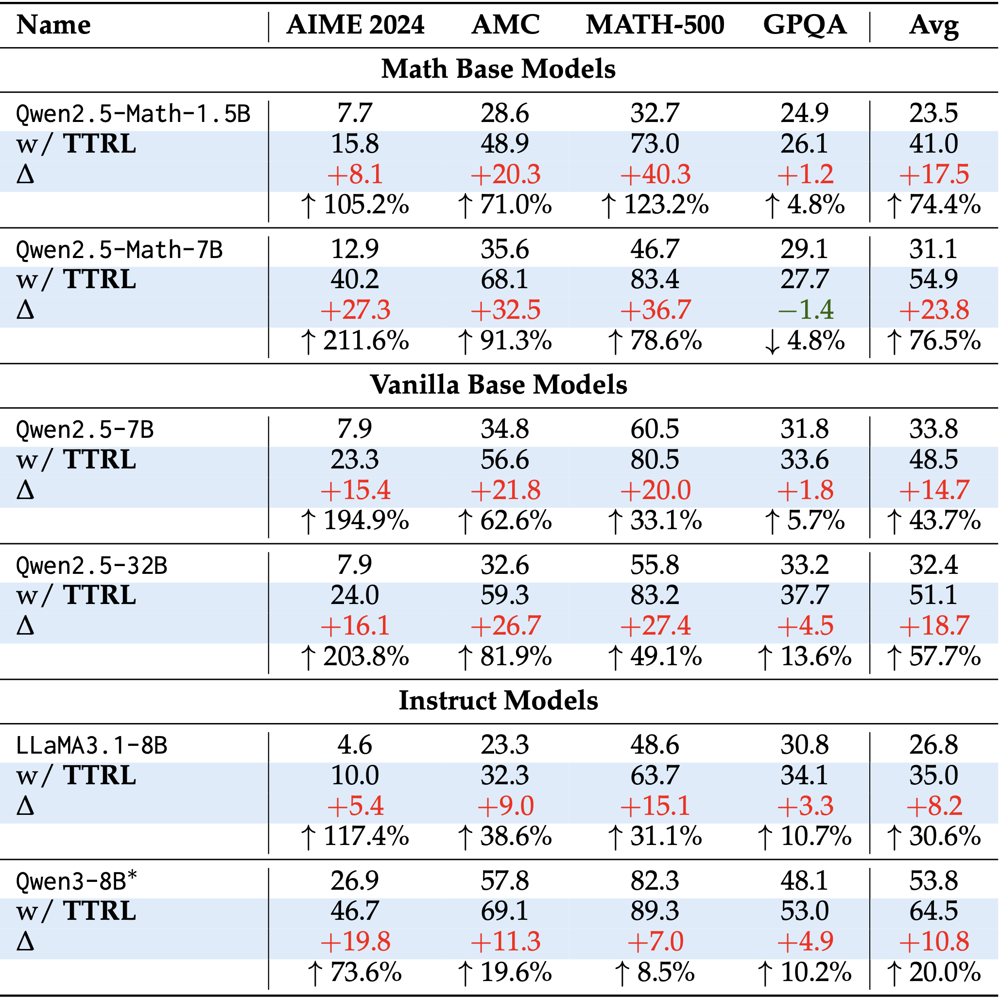

<div align="center">

# TTRL: Test-Time Reinforcement Learning

[](https://arxiv.org/abs/2504.16084)  [](https://github.com/PRIME-RL/TTRL)
[](https://wandb.ai/truman-yx-zuo-nlp/TTRL/workspace?nw=nwusertrumanyxzuo) [](https://huggingface.co/papers/2504.16084)  [](https://x.com/zuo_yuxin/status/1915406839669572036)

</div>

<div align="center" style="font-family: Arial, sans-serif;">
  <p>
    <a href="#news" style="text-decoration: none; font-weight: bold;">🎉 News</a> •
    <a href="#introduction" style="text-decoration: none; font-weight: bold;">📖 Introduction</a> •
    <a href="#main-results" style="text-decoration: none; font-weight: bold;">📊 Main Results</a>
  </p>
  <p>
    <a href="#getting-started" style="text-decoration: none; font-weight: bold;">✨ Getting Started</a> •
    <a href="#contact" style="text-decoration: none; font-weight: bold;">📨 Contact</a> •
    <a href="#citation" style="text-decoration: none; font-weight: bold;">🎈 Citation</a> •
    <a href="#star-history" style="text-decoration: none; font-weight: bold;">🌟 Star History</a>
  </p>
</div>

> Welcome to the Era of Experience.  --David Silver, Richard S. Sutton

# 🎉News
- **[2025-09-18]** TTRL paper is accepted to [NeurIPS 2025](https://neurips.cc/Conferences/2025)!
- **[2025-08-17]** We bump into [verl v0.4.1](https://github.com/volcengine/verl/releases/tag/v0.4.1), and now you can enable TTRL by simply setting `+ttrl.enable=True`!
- **[2025-05-23]** We update both the paper and the code, with the implementation based on the [verl](https://github.com/volcengine/verl).
- **[2025-04-24]** We release the code and experimental logs. Check it out: [Getting Started](#getting-started).
- **[2025-04-23]** We present **TTRL** (Test-Time Reinforcement Learning), an open-source solution for online RL on data without ground-truth labels, especially test data.

# 📖Introduction

**We investigate Reinforcement Learning (RL) on data without explicit labels for reasoning tasks in Large Language Models (LLMs).**
The core challenge of the problem is reward estimation during inference while not having access to ground-truth information. While this setting appears elusive, we find that common practices in Test-Time Scaling (TTS), such as majority voting, yield surprisingly effective rewards suitable for driving RL training.

<p align="center">
   
</p>


<p align="center">
   
</p>


# 📊Main Results

Our experiments demonstrate that TTRL consistently improves performance across a variety of tasks and models. Notably, TTRL boosts the `pass@1` performance of Qwen-2.5-Math-7B by approximately 211% on `AIME 2024` with only unlabeled test data.

Furthermore, although TTRL is only supervised by the `maj@n` metric, TTRL has demonstrated performance to consistently surpass this upper limit of the initial model, and approach the performance of models trained directly on test data with ground-truth labels.

<p align="center">
   
</p>


# ✨Getting Started

## Env Setup

```bash
git clone https://github.com/PRIME-RL/TTRL.git

cd TTRL/verl

conda create -n ttrl python==3.10
conda activate ttrl
bash scripts/install_ttrl_deps.sh
pip install -e .
```

## Reproduce TTRL
You can reproduce the results on `AIME 2024` with the following commands:

```bash
bash examples/ttrl/Qwen2.5/aime.sh
```

> [!NOTE]
> - You can use the script [verl/data/preprocess.py](https://github.com/PRIME-RL/TTRL/blob/main/verl/data/preprocess.py) to convert data from the `JSON` format to the `Parquet` format for training with verl.
> - We provide scripts in the [verl/examples/ttrl](https://github.com/PRIME-RL/TTRL/tree/main/verl/examples/ttrl) directory for running TTRL on multiple models across various benchmarks.
> - For further details regarding the code, please refer to the [verl documentation](https://verl.readthedocs.io/en/latest/index.html).

We additionally conducted three independent runs using the preview version of our code. Two of the runs achieved a pass@1 (greedy) of 43.3, while one run reached 46.7. Please refer to the [Weights & Biases logs](https://wandb.ai/truman-yx-zuo-nlp/TTRL/workspace).

*All experiments were conducted on 8 x NVIDIA A100 80GB GPUs.*

<details>
<summary>
  Pseudo-Code
</summary>

The implementation of TTRL can be achieved rapidly by simply modifying the reward function. Please refer to the following code snippet for details:

<p align="center">
   
</p>
</details>

# 📨Contact

- Kaiyan Zhang: zhang-ky22@mails.tsinghua.edu.cn
- Ning Ding: dingning@mail.tsinghua.edu.cn

# 🎈Citation
If you find TTRL helpful, please cite us.

```bibtex
@article{zuo2025ttrl,
  title={Ttrl: Test-time reinforcement learning},
  author={Zuo, Yuxin and Zhang, Kaiyan and Sheng, Li and Qu, Shang and Cui, Ganqu and Zhu, Xuekai and Li, Haozhan and Zhang, Yuchen and Long, Xinwei and Hua, Ermo and others},
  journal={arXiv preprint arXiv:2504.16084},
  year={2025}
}
```

# 🌟Star History

[](https://www.star-history.com/#PRIME-RL/TTRL&Date)
